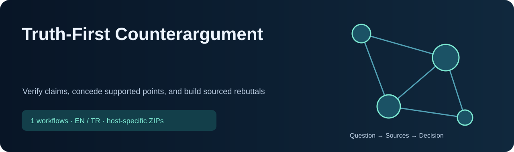
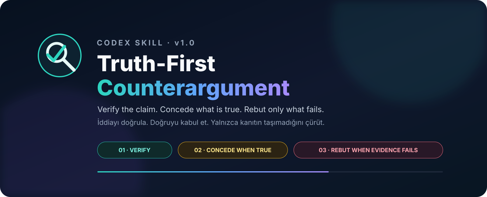
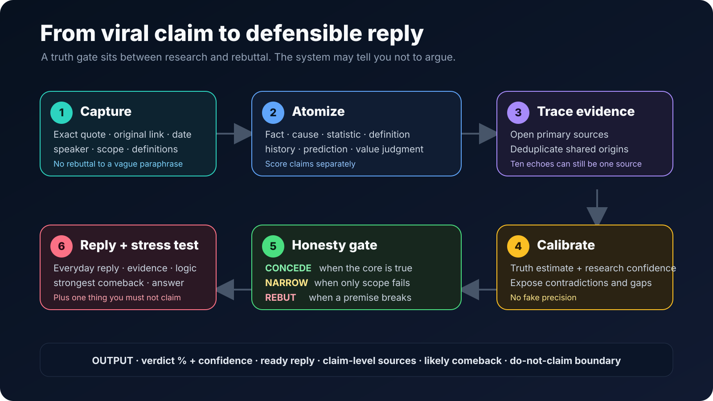
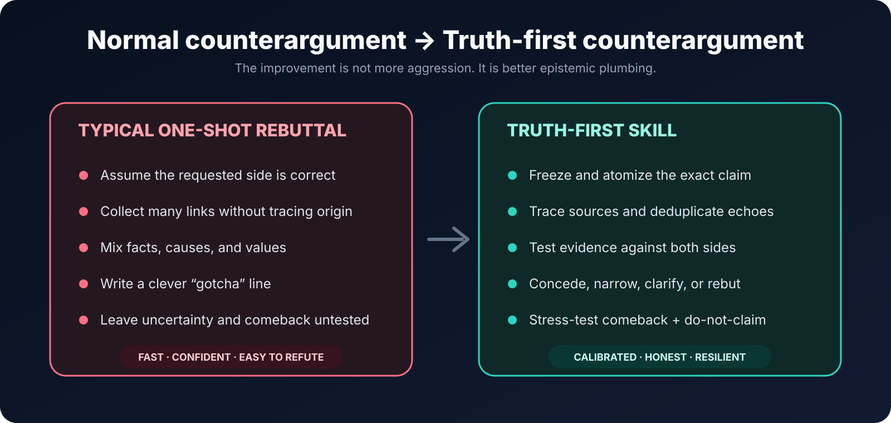
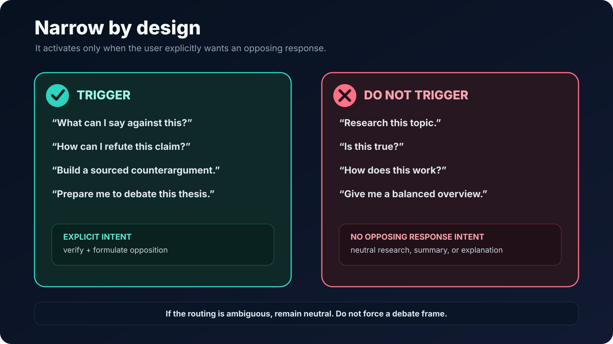
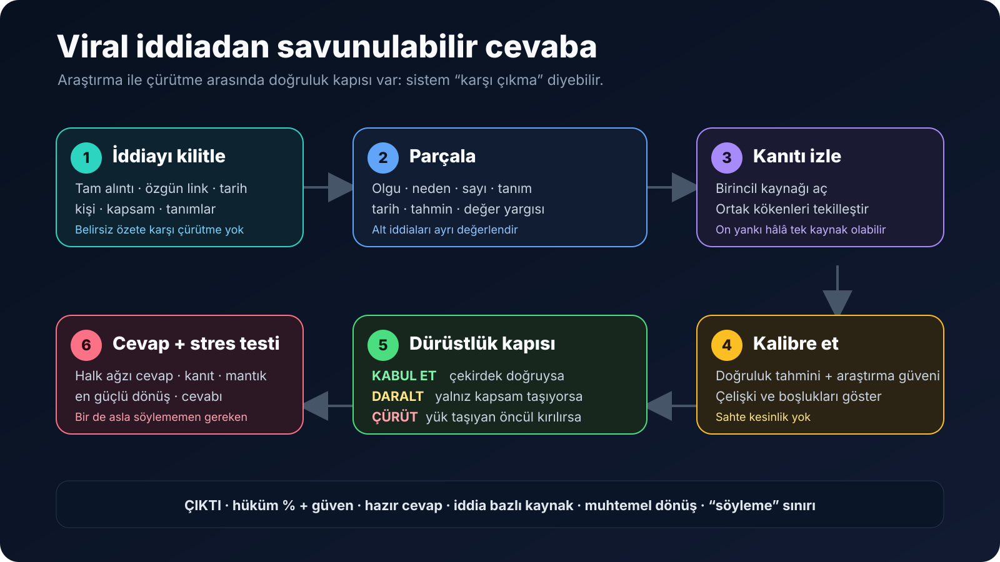
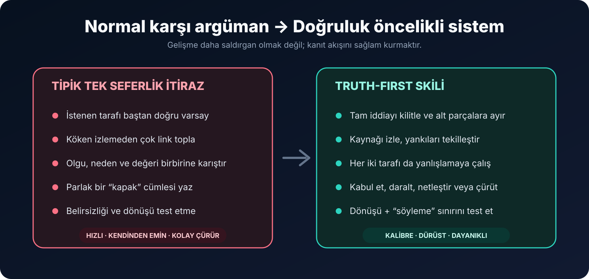
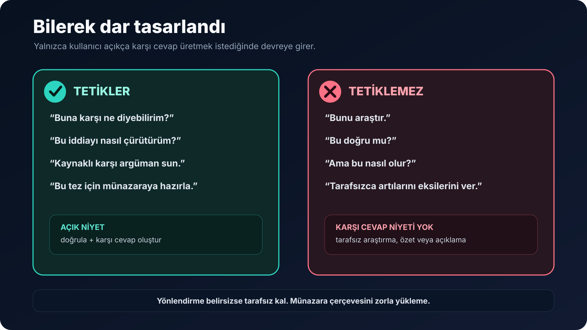

<!-- CURRENT-SKILL-PUBLICATION -->


# Truth-First Counterargument

Verify claims, concede supported points, and build sourced rebuttals. This **1 workflow** help the assistant select tools, check evidence and produce reviewable results. They do not change model weights or guarantee better decisions.

[](https://github.com/yigityildiz0/truth-first-counterargument-skill/raw/refs/heads/main/downloads/ChatGPT.zip) [](https://github.com/yigityildiz0/truth-first-counterargument-skill/raw/refs/heads/main/downloads/Claude.zip)

**ChatGPT:** the button downloads a plugin with all listed skills and supporting files. Use the personal-plugin/skill import supported by your account. A single-skill ChatGPT button downloads a one-skill plugin. **Claude:** unpack the collection ZIP, then upload its individual skill ZIPs; the outer collection is not a single Claude skill. Local Codex/Claude Code files and cloud-account installation are separate.

Use natural English or Turkish requests. A slash-prefixed word typed in chat does not register a host command. Explicit local skill invocation uses the canonical skill name; available tools, network access and credentials remain host-dependent.

## Included skills

| Skill | What it solves / example request | ChatGPT | Claude |
|---|---|---|---|
| [`truth-first-counterargument`](skills/common/truth-first-counterargument/SKILL.md) | Evidence-first verification and rebuttals to specific claims. Use only when the user explicitly wants an opposing or corrective response, for example "what can I say against this?", "how can I refute this?", rebut/refute/debunk/dismantle/challenge a claim, draft a sourced correction to alleged misinformation, argue against a specified thesis, "buna karşı ne diyebilirim?", "karşı argüman sun", "bu iddiayı nasıl çürütebilirim", "bu teze karşı münazaraya hazırla", or "yanlış bilgiye düzeltme cevabı yaz". Conditional evidence-first rebuttal requests qualify. Do not use for ordinary research, neutral fact-checking, summaries, explanations, generic critique, "ama bu nasıl olur?", ordinary reply drafting, balanced or two-sided debate preparation, or lists of other people's objections. Negated, quoted, defined, or merely reported rebuttal terms do not trigger. The user must want an opposing/corrective response produced. Verify first and recommend concession when the claim is well supported. | [↓ ZIP](packages/chatgpt/truth-first-counterargument.zip) | [↓ ZIP](packages/claude/truth-first-counterargument.zip) |

## Installation and technical boundaries

- Full canonical sources: `skills/common/`; provider packages: `packages/chatgpt/`, `packages/claude/`, `packages/codex/`.
- Every Claude skill has at most 200 files and a description of at most 200 characters. ZIPs include all files of the selected provider source.
- External services (Gemini, Parallel, Context7), local CLIs and subscriptions are not provided by these ZIPs. Report missing tools rather than simulating access.
- Validation checks package integrity, paths, descriptions, source/package parity and hashes. It is not a live account-installation test or a clinical/financial effectiveness claim.
- See [checksums](downloads/SHA256SUMS.txt), [provenance](PUBLICATION.md), and [third-party notices](THIRD_PARTY_NOTICES.md). Existing license and copyright files retain their scope; there is no blanket license grant over third-party content.

<!-- END-CURRENT-SKILL-PUBLICATION -->

<div align="center">



[](VERSION)
[](LICENSE)
[](#türkçe)
[](https://github.com/yigityildiz0/truth-first-counterargument-skill/actions/workflows/validate.yml)

**Verify the claim. Concede what is true. Rebut only what the evidence cannot carry.**

[Download ready-to-install ZIP](https://github.com/yigityildiz0/truth-first-counterargument-skill/releases/latest/download/truth-first-counterargument.zip) · [Browse the skill](skills/truth-first-counterargument/SKILL.md) · [Türkçe](#türkçe)

</div>

## What this is

`truth-first-counterargument` is a narrowly triggered Codex skill for evidence-backed rebuttals. Give it a post, video, quote, news item, ideological thesis, religious argument, or factual claim and explicitly ask what to say against it. The skill first verifies the claim, traces the source chain, exposes shared-origin reporting, and calibrates claim-level truth estimates. Only then does it decide whether to concede, narrow, clarify, counter a value premise, or rebut.

It is not a “win every argument” prompt. If the target's core claim is well supported, the correct output is: **do not oppose it**.

[](docs/assets/workflow-en.svg)

## Why it is different

| Typical one-shot counterargument | With this skill |
|---|---|
| Assumes the user must be right | Treats the user's preferred side as a hypothesis |
| Counts repeated articles as confirmation | Traces upstream origins and deduplicates copied reporting |
| Scores a whole paragraph at once | Splits factual, causal, statistical, definitional, and value claims |
| Produces a confident percentage with no calibration | Reports a rounded estimate plus separate research confidence and limits |
| Searches for ammunition | Searches for evidence that could falsify both sides |
| Generates many clever points | Attacks the smallest load-bearing weakness |
| Hides concessions | States what the opponent gets right before objecting |
| Stops after writing a reply | Tests the strongest likely comeback and removes weak claims |

[](docs/assets/before-after-en.svg)

## Narrow trigger boundary

The skill is designed **not** to activate on ordinary research or casual questions.

[](docs/assets/trigger-map-en.svg)

### Intended automatic triggers

- “What can I say against this?”
- “How can I refute this claim?”
- “Fact-check this, then build the strongest honest rebuttal.”
- “Prepare me to debate this thesis.”
- “Steelman this post and then dismantle its weakest premise.”

### Should not trigger

- “Research this topic.”
- “Is this true?”
- “How does this work?”
- “Summarize this article.”
- “Give me a balanced overview.”

You can always invoke it explicitly with `$truth-first-counterargument`.

## What the output contains

1. **Verdict** — core claim, truth estimate, research confidence, and decision route.
2. **Claim audit** — separate results for each atomic claim.
3. **Ready-to-use reply** — natural language, not debate jargon.
4. **Why it works** — the decisive logic and evidence.
5. **Likely comeback → answer** — the strongest informed response, not a straw man.
6. **Do not claim** — tempting overstatements that would weaken your position.
7. **Sources and uncertainty** — claim-level citations, gaps, and what would change the verdict.

See the [English fictional formatting example](examples/example-en.md). It demonstrates structure only; it is not evidence about a real event.

## Calibrated truth estimates

The skill normally rounds to the nearest 5 and always separates:

- **truth estimate**: the current balance of evidence for an atomic claim;
- **research confidence**: how complete, direct, independent, and interpretable that evidence is.

The included [`confidence_calibrator.py`](skills/truth-first-counterargument/scripts/confidence_calibrator.py) is a consistency check for structured evidence ledgers. It uses the researching agent's audited `independence_group` labels and also merges identical canonical URLs; it does not discover source ancestry by itself. It caps extreme scores when coverage is weak. It is explicitly heuristic—not a statistical probability engine and never a substitute for reading the sources.

## Installation

### Easiest: ready-to-install ZIP

1. Download [`truth-first-counterargument.zip`](https://github.com/yigityildiz0/truth-first-counterargument-skill/releases/latest/download/truth-first-counterargument.zip).
2. Extract the `truth-first-counterargument` folder into:
   - Windows: `%USERPROFILE%\.codex\skills\`
   - macOS/Linux: `~/.codex/skills/`
3. Restart Codex.

### Windows installer

```powershell
git clone https://github.com/yigityildiz0/truth-first-counterargument-skill.git
cd truth-first-counterargument-skill
powershell -ExecutionPolicy Bypass -File .\install.ps1
```

The installer backs up an existing copy before replacing it.

### macOS/Linux installer

```bash
git clone https://github.com/yigityildiz0/truth-first-counterargument-skill.git
cd truth-first-counterargument-skill
sh ./install.sh
```

### Manual / compatible agents

Copy [`skills/truth-first-counterargument`](skills/truth-first-counterargument) into the host's skill directory. Hosts that do not implement Codex skill discovery can still use `SKILL.md` as a reusable instruction file, but automatic triggering is host-dependent.

## Example usage

Automatic:

```text
Here is the transcript and original link. What can I say against this claim?
First verify it, and tell me not to oppose it if the core is actually true.
```

Explicit:

```text
Use $truth-first-counterargument on this post. Give me a short everyday reply,
the evidence behind it, the strongest comeback, and what I must not claim.
```

## Repository layout

```text
skills/truth-first-counterargument/
├── SKILL.md                 # narrow trigger + core workflow
├── agents/openai.yaml       # UI metadata
├── references/              # research, argument, domain, output, integrity protocols
├── scripts/                 # confidence consistency checker
└── assets/                  # reusable case-file template

docs/assets/                 # bilingual infographics
examples/                    # fictional output-format examples
tests/                       # package, trigger-contract, and calibrator tests
```

## Validation

No external Python packages are required.

```bash
python tests/verify_package.py
python -m unittest discover -s tests -v
powershell -ExecutionPolicy Bypass -File .\build-release.ps1
python tests/verify_release.py
```

GitHub Actions runs the same checks on Windows and Linux with multiple Python versions.

[`tests/trigger-cases.json`](tests/trigger-cases.json) is a routing contract and regression checklist, not proof of live model selection. Automatic skill routing remains host/model-dependent.

## Integrity limits

This skill attacks claims, not people. It does not support harassment, dogpiling, doxxing, threats, fabricated citations, quote-mining, identity-based attacks, covert manipulation, or “win at any cost” rhetoric. It does support firm, well-sourced disagreement.

## License

MIT — use, modify, and share it. Contributions that improve calibration, source provenance, multilingual triggering, and domain checklists are welcome.

---

<a id="türkçe"></a>

# Türkçe

## Bu nedir?

`truth-first-counterargument`, yalnızca açık karşı-argüman/çürütme niyetinde devreye girmesi için dar tasarlanmış bir Codex skilidir. Bir gönderi, video, alıntı, haber, ideolojik tez, dini argüman veya olgusal iddia verip “buna karşı ne diyebilirim?” dediğinde önce iddiayı doğrular; kaynak zincirini asıl kökene kadar izler; aynı kaynağı tekrarlayan haberleri bağımsız kanıt saymaz; alt iddialara ayrı doğruluk tahmini verir. Ardından **kabul et, daralt, açıklığa kavuştur, değer öncülüne karşı çık veya çürüt** yollarından birini seçer.

Bu, “her tartışmayı kazan” promptu değildir. Karşı tarafın çekirdek iddiası güçlü biçimde doğruysa doğru sonuç şudur: **karşı çıkma**.

[](docs/assets/workflow-tr.svg)

## Normal cevap ile bu skil arasındaki fark

| Tipik tek seferlik karşı argüman | Bu skil ile |
|---|---|
| Kullanıcının haklı olması gerektiğini varsayar | Kullanıcının tarafını doğrulanacak hipotez sayar |
| Aynı haberi tekrarlayan siteleri ayrı kanıt sayar | Haberleri kök kaynağa kadar izler ve ortak kökeni tekilleştirir |
| Bütün paragraf için tek hüküm verir | Olgu, neden, sayı, tanım ve değer yargısını ayırır |
| Dayanaksız kesin yüzde verir | Yuvarlanmış tahmin + ayrı araştırma güveni + sınırlar verir |
| Cephane arar | Her iki tarafı da yanlışlayabilecek kanıtı arar |
| Çok sayıda parlak ama zayıf nokta üretir | Yük taşıyan en küçük kırılma noktasına odaklanır |
| Doğru kısımları gizler | İtirazdan önce haklı kısmı açıkça kabul eder |
| Cevabı yazıp bırakır | En güçlü dönüşü test eder ve zayıf iddiaları çıkarır |

[](docs/assets/before-after-tr.svg)

## Dar tetikleme sınırı

Skil, sıradan araştırma veya günlük sorularda çalışmaması için özellikle sınırlandı.

[](docs/assets/trigger-map-tr.svg)

### Otomatik tetiklemesi amaçlanan örnekler

- “Buna karşı ne diyebilirim?”
- “Bu iddiayı nasıl çürütebilirim?”
- “Önce doğrula, sonra kaynaklı karşı argüman sun.”
- “Bu tez için beni münazaraya hazırla.”
- “Karşı tarafın en güçlü halini kurup sonra çürüt.”

### Tetiklememesi gereken örnekler

- “Bunu araştır.”
- “Bu doğru mu?”
- “Ama bu nasıl olur?”
- “Bu haberi özetle.”
- “Tarafsızca artılarını ve eksilerini ver.”

İstersen `$truth-first-counterargument` yazarak açıkça çağırabilirsin.

## Çıktıda neler var?

1. **Hüküm** — çekirdek iddia, doğruluk tahmini, araştırma güveni ve karar yolu.
2. **İddia denetimi** — her alt iddia için ayrı sonuç.
3. **Hazır cevap** — ders kitabı dili değil, doğal/halk ağzı.
4. **Neden işe yarıyor** — belirleyici mantık ve dayanak.
5. **Muhtemel dönüş → cevabın** — zayıf karikatür değil, bilgili karşı tarafın en güçlü dönüşü.
6. **Şunu söyleme** — senin konumunu zayıflatacak abartılar.
7. **Kaynaklar ve belirsizlik** — iddia bazlı bağlantılar, boşluklar ve hükmü neyin değiştireceği.

[Türkçe kurgusal biçim örneğine](examples/example-tr.md) bakabilirsin. Yalnızca yapıyı gösterir; gerçek bir olay için kanıt değildir.

## Doğruluk yüzdesi nasıl veriliyor?

Skil normalde en yakın 5'e yuvarlar ve iki şeyi ayırır:

- **doğruluk tahmini**: alt iddiayı destekleyen/çürüten mevcut kanıt dengesi;
- **araştırma güveni**: kanıtların kapsamı, doğrudanlığı, bağımsızlığı ve yorumlanabilirliği.

Paket içindeki [`confidence_calibrator.py`](skills/truth-first-counterargument/scripts/confidence_calibrator.py), düzenli kanıt tabloları için tutarlılık kontrolüdür. Araştırmayı yapan ajanın denetleyip verdiği `independence_group` etiketlerini kullanır ve aynı kanonik URL'leri birleştirir; kaynak soyunu kendi başına keşfetmez. Araştırma zayıfsa aşırı yüzdeleri sınırlar. İstatistiksel olasılık motoru değildir; kaynak okumasının yerini tutmaz.

## Kurulum

### En kolay: hazır ZIP

1. [`truth-first-counterargument.zip`](https://github.com/yigityildiz0/truth-first-counterargument-skill/releases/latest/download/truth-first-counterargument.zip) dosyasını indir.
2. İçindeki `truth-first-counterargument` klasörünü şuraya çıkar:
   - Windows: `%USERPROFILE%\.codex\skills\`
   - macOS/Linux: `~/.codex/skills/`
3. Codex'i yeniden başlat.

### Windows otomatik kurulum

```powershell
git clone https://github.com/yigityildiz0/truth-first-counterargument-skill.git
cd truth-first-counterargument-skill
powershell -ExecutionPolicy Bypass -File .\install.ps1
```

Kurucu, eski bir kopya varsa üzerine yazmadan önce tarihli yedeğini alır.

### macOS/Linux otomatik kurulum

```bash
git clone https://github.com/yigityildiz0/truth-first-counterargument-skill.git
cd truth-first-counterargument-skill
sh ./install.sh
```

### Elle / uyumlu ajanlara kurulum

[`skills/truth-first-counterargument`](skills/truth-first-counterargument) klasörünü kullandığın aracın skill dizinine kopyala. Codex skill keşfini uygulamayan araçlar `SKILL.md` dosyasını yeniden kullanılabilir talimat olarak okuyabilir; otomatik tetikleme kullandığın araca bağlıdır.

## Kullanım örneği

Otomatik:

```text
İşte videonun tam metni ve özgün bağlantısı. Buna karşı ne diyebilirim?
Önce doğrula; çekirdek iddia doğruysa bana karşı çıkmamam gerektiğini söyle.
```

Açık çağrı:

```text
Bu gönderide $truth-first-counterargument kullan. Kısa halk ağzı cevap,
dayanakları, en güçlü geri dönüşü ve söylememem gereken iddiayı ver.
```

## Güvenlik ve dürüstlük sınırı

Bu skil kişiye değil iddiaya saldırır. Taciz, linç, özel bilgi yayma, tehdit, uydurma kaynak, bağlamdan koparma, kimlik temelli saldırı, gizli manipülasyon veya “ne pahasına olursa olsun kazan” yaklaşımını desteklemez. Sert ama kanıtlı ve adil itirazı destekler.

## Doğrulama

Harici Python paketi gerekmez.

```powershell
python tests\verify_package.py
python -m unittest discover -s tests -v
powershell -ExecutionPolicy Bypass -File .\build-release.ps1
python tests\verify_release.py
```

GitHub Actions aynı kontrolleri Windows ve Linux üzerinde çalıştırır. `tests/trigger-cases.json` canlı model yönlendirmesinin kanıtı değil; amaçlanan tetikleme sözleşmesi ve regresyon listesidir. Otomatik skill seçimi kullanılan araca/modele bağlıdır.

## Lisans

MIT — kullanabilir, değiştirebilir ve paylaşabilirsin.
